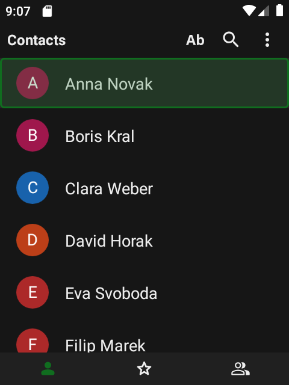
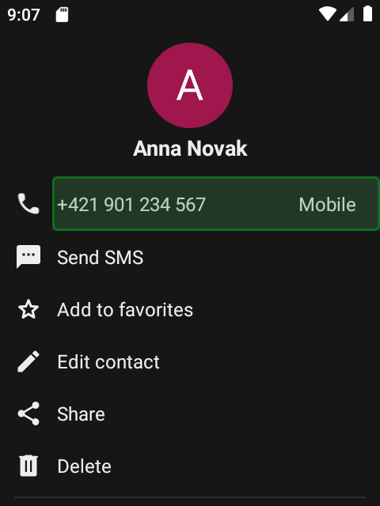
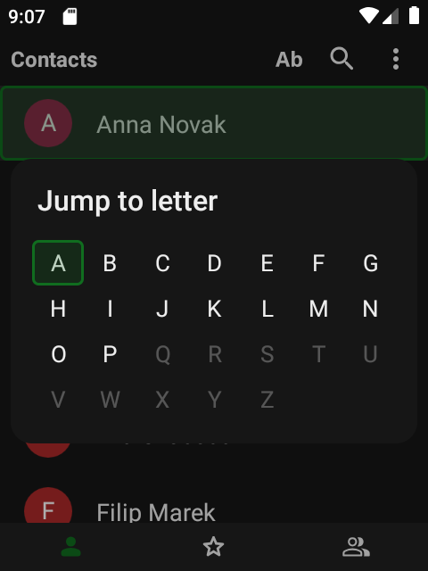
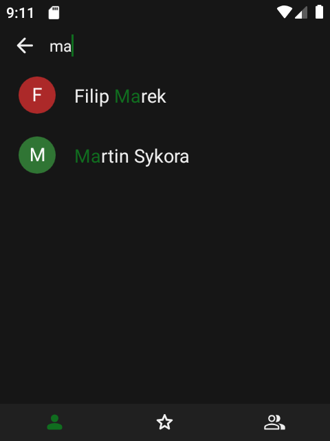
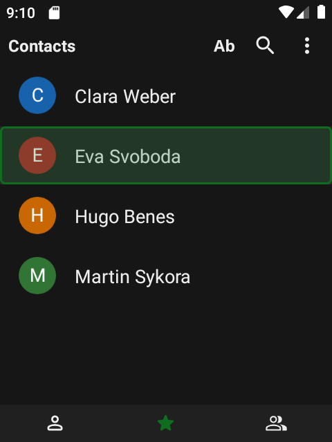
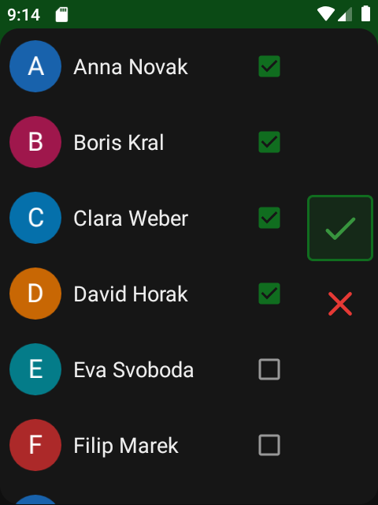
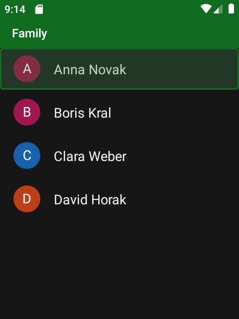
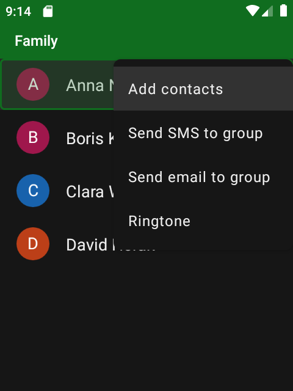
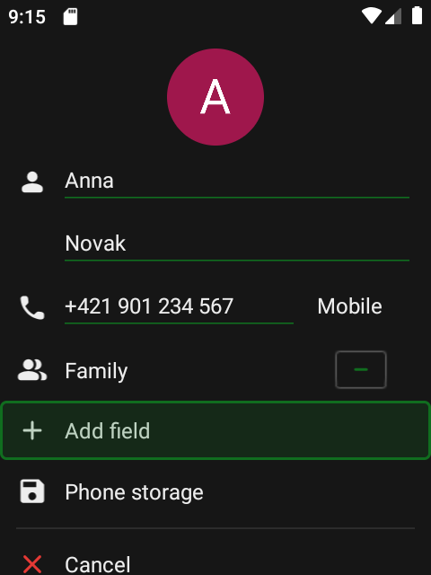
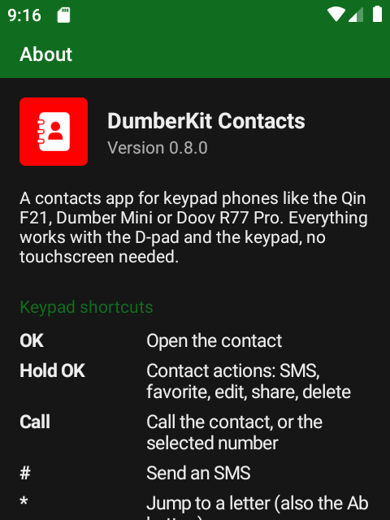

# DumberKit: Contacts


[](https://ko-fi.com/lbockaj)

A contacts app made for **keypad phones** – the Qin F21, Dumber Mini, Doov R77 Pro and other small Android phones
with a D-pad and a T9 keypad. Its core is [Fossify Contacts](https://github.com/FossifyOrg/Contacts). Every screen, menu and dialog works with the keys alone, no touchscreen needed.
There are no floating buttons, no tiny touch targets and no swiping, and the layout is compact enough for a
480×640 screen.

<div align="center">





</div>

## Keypad shortcuts

### Contact list

| Key | Action |
| --- | --- |
| **OK** (D-pad center) | Open the contact |
| **Hold OK** | Contact actions: send SMS, add to / remove from favorites, edit, share, delete |
| **Call** (green key) | Call the selected contact |
| **#** | Send an SMS to the selected contact |
| **\*** or the **Ab** button (next to search) | Jump to a letter: pick it in an A–Z grid (arrows, or `2`–`9` like on the keys), the list jumps to the first contact starting with it |
| **← / →** | Switch between Contacts, Favorites and Groups |
| **↑** on the first contact | Move up to the top bar: Jump to letter (Ab), Search, Menu – the app starts there, on Ab |
| **Menu** | New contact (first item), sort, filter, dialer, settings, about |
| **Back** | Jump to the first contact; Back again leaves the app. Closes the search first when it's open |

### Contact details

| Key | Action |
| --- | --- |
| **↑ / ↓** | Move through the phone numbers and actions |
| **Call** | Call the selected number |
| **#** | Send an SMS to the selected number |
| **OK** | Run the selected action: call, send SMS, e-mail, add to favorites, edit, share, delete |
| **Menu** | More actions |

### Editing a contact

| Key | Action |
| --- | --- |
| **↑ / ↓** | Move field by field, in order |
| **Add field** row | Add a phone number, e-mail, address, birthday and more |
| **Cancel** / **Save** rows | At the end of the form, under a divider – red cross and green check |
| **Back** | Asks whether to save the changes (No is preselected) |

The date picker (birthdays, anniversaries) works with the arrows and digits too: type the day, month and year,
**→** moves on to *Hide year*, *Cancel* and *OK*.

<div align="center">





</div>

## Features

- **Search** – the magnifier in the top bar opens the search field, names are typed letter by letter (ABC) on
  T9 keyboards; matching name starts come first.
- **Jump to a letter** – the *Ab* button or `*` opens an A–Z grid, letters without contacts are greyed out.
- **Works with the T9 keyboard** – the search field starts in letters (ABC) mode with
  [Traditional T9](https://github.com/sspanak/tt9).
- **Simple contact details** – the numbers on top, then *Send SMS*, *Favorite*, *Edit*, *Share* and *Delete* as rows.
  Messenger accounts (WhatsApp, Viber, Signal, Telegram…) are listed with their icons, the storage of the contact last.
- **Numbers formatted for your country**, the default number marked with a small star.
- **Favorites and groups**, each in its own tab. In a group, *Menu* adds contacts, sends an SMS or e-mail to the whole
  group or sets its ringtone; holding OK on a group renames or deletes it.
- **Keypad-friendly settings and dialogs** – every option, list and confirmation can be reached with the arrows.
- **Colors and themes** – System (follows Android), light, dark and custom themes. The color picker works in steps:
  hue bar, then the shade square, then *Cancel* / *Save*.
- **Back up and move your contacts** – import and export vCard (.vcf) files (in Android's own file picker),
  automatic backups.
- **Private** – no ads, no tracking, no internet access; the contacts stay in Android's own contact storage
  (phone, SIM or your sync account).
- **Keys only** – touches are ignored everywhere in the app (screens, dialogs, menus), so nothing gets pressed by
  accident; *Settings → Allow touch input* turns touch back on. Other apps opened from here keep their touch.
- **Portrait only**, sized for small screens; available in 70+ languages.

## Install

1. Download `dumberkit-contacts.apk` from the [latest release](../../releases/latest).
2. Open it on the phone and allow installing apps from that source when Android asks.
3. Start **Contacts** with the red icon and allow access to your contacts.

Requires Android 8.0 or newer.

## Build

```bash
./gradlew assembleFossRelease
```

The release build is signed with the key from `keystore.properties` (see `keystore.properties_sample`), the APK
ends up in `app/build/outputs/apk/foss/release/`. Debug builds are noticeably slower on low-end keypad phones,
judge the speed on a release build.

## License

DumberKit: Contacts is free software under the [GNU General Public License v3.0](LICENSE).

## Credits

The core of the app is [Fossify Contacts](https://github.com/FossifyOrg/Contacts) and its
[Commons](https://github.com/FossifyOrg/Commons) library (GPL-3.0) – contact storage, editing, import/export, themes
and translations come from there. DumberKit: Contacts is a modified version, reworked in 2026 for keypad navigation
and small screens. Thanks to the Fossify team and its translators.
